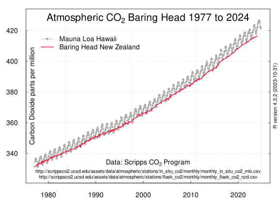

## Atmospheric Carbon Dioxide Baring Head and Maunu Loa

This is an R Markdown document of r script to create a chart of atmospheric carbon dioxide at Baring Head, New Zealand and at Maunu Loa, Hawaii, USA.

Obtain the CO2 data from Scripps

```{r}
urlnz <- c("http://scrippsco2.ucsd.edu/assets/data/atmospheric/stations/flask_co2/monthly/monthly_flask_co2_nzd.csv")
download.file(urlnz, "co2_nzd.csv")
rm(urlnz)
```

```{r}
urlmlo <- c("http://scrippsco2.ucsd.edu/assets/data/atmospheric/stations/in_situ_co2/monthly/monthly_in_situ_co2_mlo.csv")
download.file(urlmlo, "co2_mlo.csv")
rm(urlmlo)
```
Read in the Baring Head data skipping the first 57 rows

```{r}
bhd <- read.csv("co2_nzd.csv",skip=57,header=FALSE, sep = ",",dec=".",stringsAsFactors =FALSE, strip.white =TRUE ,na.strings =-99.99)
```
examine the dataframe

```{r}
str(bhd)
```
create dataframe of date and CO2 data
```{r}
bhd1 <- data.frame(Date = as.Date(bhd[,3], origin = "1900-01-01"), CO2=bhd[,10])
```
Read in the Mauna Loa data skipping the first 291 rows so first row is 1977 07
```{r}
mlo <- read.csv("co2_mlo.csv",skip=291,header=FALSE, sep = ",",dec=".",na.strings =-99.99)
```
delete last two rows of NAs 
```{r}
mlo <- mlo[-c(573,574),]
```
create dataframe of date and CO2 data
```{r}
mlo1 <- data.frame(Date = as.Date(mlo[,3], origin = "1900-01-01"), CO2=mlo[,9])
```

Create a chart

```{r}
svg(filename ="Baringhead_co2_720-540.svg", width = 8, height = 6, pointsize = 14, onefile = FALSE, family = "sans", bg = "white")    
par(mar=c(3.1,3.1,1,1)+0.1)
plot(mlo1,ylim=c(325,430),tck=0.01, axes=T,ann=F,las=1,pch=20, cex=0.75,type="o",col="darkgray",lwd=1)
axis(side=4, tck=0.01,  labels = FALSE, tick = T,lwd=0,lwd.tick=1)
grid()
lines(bhd1, col="#ED1A3B",lwd=2,lty=1)
mtext(side=2,cex=1, line=-1.5,expression(paste("Carbon Dioxide parts per million")))
mtext(side=3,cex=1.5, line=-2,expression(paste("Atmospheric C", O[2], " Baring Head 1977 to 2024")))
mtext(side=1,line=-2.8,cex=1,expression(paste("Data: Scripps C", O[2], " Program")))
mtext(side=1,cex=0.7, line=-1.3,"http://scrippsco2.ucsd.edu/assets/data/atmospheric/stations/in_situ_co2/monthly/monthly_in_situ_co2_mlo.csv\nhttp://scrippsco2.ucsd.edu/assets/data/atmospheric/stations/flask_co2/monthly/monthly_flask_co2_nzd.csv")
legend(2952, 420, bty="n", c("Mauna Loa Hawaii", "Baring Head New Zealand"), lwd=c(1,2), pch=c(20,NA),lty = 1, col = c("darkgray","#ED1A3B"))
mtext(side=4,cex=0.75, line=0.05,R.version.string)
dev.off()
```

